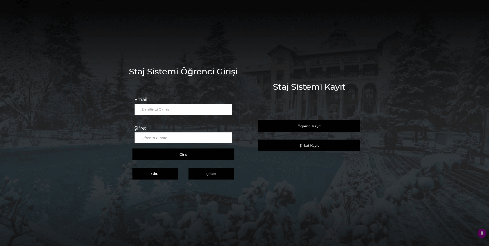
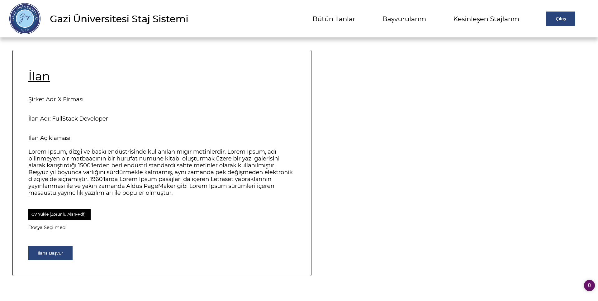

# Intern-Information-System-Development

This is my bachelor final project.

## User Types
1) Students
2) Teachers
3) Companies that want to publish internship ads.

## Roles
Students can
<ul>
  <li> see internship ads which are published by companies</li>
  <li> apply these ads by uploading their CV</li>
  <li> watch their application status from "my applications page"</li>
  <li> see the finalized internship (means the company accepted your application and the teacher confirmed it)</li>
  <li> upload their internship notebook to the system</li>
</ul>

Teachers can
<ul>
  <li> see the responsible person for students during the internship</li>
  <li> reject the internship of students even if the company accept the student</li>
  <li> see the students, the ads that the students applied and the company which is responsible for the ad</li>
  <li> download the student internship notebook and/or the documents which are uploaded by companies</li>
</ul>

Companies can
<ul>
  <li> publish their internship programs</li>
  <li> see the students information (their name, surname, GPA, class number and CV) if students apply for their program</li>
  <li> accept or reject the students</li>
  <li> upload necessary documents in the system (if student's school wants anything)</li>
</ul>

## Website Images

 

* You can check out github-images folder to see more images about website.

## How to use

<ul>
  <li>Download the file</li>
  <li>Fill the necessary places on config.env file</li>
  <li>Write npm install and press enter to download necessary packages</li>
  <li>Write npm start to start the localhost on port 8000</li>
  <li>You might need to close adblocker if you're using it</li>
</ul>

